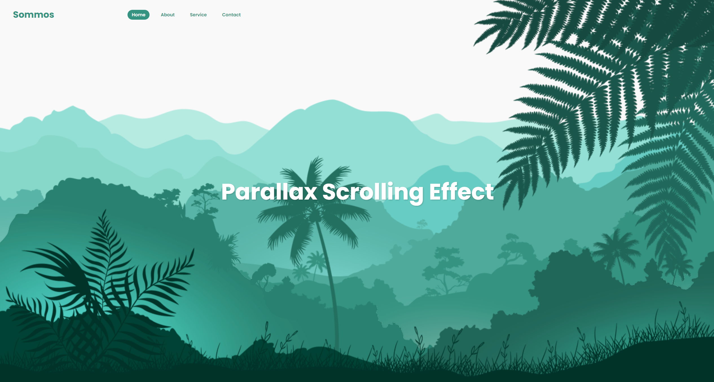

# Javascript Parallax Scrolling Website

    

This program is to test a javascript parallax scroll effect.

This has been built into a web application accessible here: https://sommos.github.io/javascript_parallax_scrolling_website

# Contribution 

If you'd like to contribute to `javascript_parallax_scrolling_website` please submit a pull-request on a feature branch.

# Installing

Clone the repo:

    git clone https://github.com/Sommos/javascript_parallax_scrolling_website
    cd javascript_parallax_scrolling_website